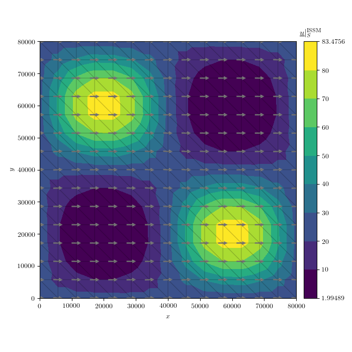

ISMIP-HOM
===========

We begin with an example that does not require any external data; the "`Ice Sheet Model Intercomparison Project for Higher-Order Models <http://homepages.ulb.ac.be/~fpattyn/ismip/>`_".

Set up the model
----------------

First, import all the packages we will need::

  import issm  as im
  import numpy as np

First, create an empty :class:`~issm.model.model` instance and name the simulation::

  md = im.model()
  md.miscellaneous.name = 'ISMIP_HOM_A'
  
Next, we make a simple three-dimensional box mesh with 49 cells in the :math:`x` and :math:`y` directions over a width of 8 km using :class:`~issm.squaremesh.squaremesh`::

  L  = 80000.0
  n  = 15
  md = im.squaremesh(md, L, L, n, n)

Let the entire domain be defined over grounded ice with :class:`~issm.setmask.setmask`::

  md = im.setmask(md, 'all', '')

The ISMIP-HOM experiment "A" geometry is created by directly editing the coordinates of the :class:`~issm.mesh2d.mesh2d` instance created above::
  
  # surface :
  md.geometry.surface = - md.mesh.x * np.tan(0.5*np.pi/180.0)
  
  # base of ice sheet with 'L' the size of the side of the square :
  md.geometry.base = + md.geometry.surface - 1000.0 \
                     + 500.0 * np.sin(md.mesh.x*2*np.pi/L) \
                             * np.sin(md.mesh.y*2*np.pi/L)
  
  # thickness is the difference between surface and base :
  md.geometry.thickness = md.geometry.surface - md.geometry.base

We will also need to define the element-wise multiplicative identities::

  v_ones = np.ones(md.mesh.numberofvertices)  # rank-zero tensor vertex
  e_ones = np.ones(md.mesh.numberofelements)  # rank-zero tensor element

The material parameters may be changed to match those of the ISMIP HOM experiment by changing either the :class:`~issm.model.model`'s :class:`~issm.constants.constants` or material properties :class:`~issm.matice.matice`::

  md.materials.rho_ice    = 910.0              # ice density
  md.constants.g          = 9.80665            # gravitational acc.
  md.constants.yts        = 31556926.0         # seconds per year
  n                       = 3.0                # Glen's flow exponent
  spy                     = md.constants.yts   # s a^{-1}
  A                       = 1e-16              # Pa^{-n} s^{-1}
  B                       = (A / spy)**(-1/n)
  md.materials.rheology_B = B * v_ones
  md.materials.rheology_n = n * e_ones

While no-slip basal velocity boundary conditions are imposed, the :class:`~issm.friction.friction` coefficient must be defined::
 
  md.friction.coefficient = 1.0 * v_ones
  md.friction.p           = 1.0 * e_ones
  md.friction.q           = 0.0 * e_ones

Next, configure the model for "ice-sheet" boundary conditions via :class:`~issm.SetIceSheetBC.SetIceSheetBC`, extrude vertically 5 cells in the :math:`z` direction with :func:`~issm.model.model.extrude`, and set the appropriate "flow equation" with :class:`~issm.setflowequation.setflowequation`::
 
  md = im.SetIceSheetBC(md)  # create placeholder arrays for indicies 
  md.extrude(6, 1.0)
  md = im.setflowequation(md, mdl_odr, 'all')

Now that the 2D mesh has been converted to 3D, we have to redefine the element-wise multiplicitave identies::

  v_ones = np.ones(md.mesh.numberofvertices)  # rank-zero tensor vertex
  e_ones = np.ones(md.mesh.numberofelements)  # rank-zero tensor element

The no-slip basal-velocity boundary conditions are then set within the :class:`~issm.model.model` property :class:`~issm.stressbalance.stressbalance`:: 
  	
  md.stressbalance.spcvx = np.nan * v_ones
  md.stressbalance.spcvy = np.nan * v_ones
  md.stressbalance.spcvz = np.nan * v_ones
  
  basal_v                         = md.mesh.vertexonbase
  md.stressbalance.spcvx[basal_v] = 0.0
  md.stressbalance.spcvy[basal_v] = 0.0
  md.stressbalance.spcvz[basal_v] = 0.0

The periodic-velocity-lateral-boundary conditions specified by the ISMIP HOM experiment are defined by pairing lateral nodes as follows:: 
  
  minX = np.where(md.mesh.x == 0)[0] + 1
  maxX = np.where(md.mesh.x == L)[0] + 1
  
  # for y, maxX and minX should be excluded :
  minY = np.where(np.logical_and(md.mesh.y == 0,
                                 md.mesh.x != L,
                                 md.mesh.x != 0))[0] + 1
  maxY = np.where(np.logical_and(md.mesh.y == L,
                                 md.mesh.x != L,
                                 md.mesh.x != 0))[0] + 1
  
  # set the nodes that should be paired together :
  md.stressbalance.vertex_pairing = np.array([np.append(minX, minY),
                                              np.append(maxX, maxY)]).T

Solve the momentum balance
--------------------------

Now, set up the computing environment variables using the :class:`~issm.generic.generic` class, enable verbose solver output with :class:`~issm.verbose.verbose`, and finally solve the system with the :class:`~issm.solve.solve` class::
  
  md.cluster = im.generic('name', im.gethostname(), 'np', 1)
  md.verbose = im.verbose('convergence', True)
  md         = im.solve(md, 'Stressbalance')

Plot the results
----------------

You can plot the resulting variables on the surface or the be easily like so::

  p   = md.results.StressbalanceSolution.Pressure[md.mesh.vertexonbase]
  u_x = md.results.StressbalanceSolution.Vx[md.mesh.vertexonsurface] 
  u_y = md.results.StressbalanceSolution.Vy[md.mesh.vertexonsurface] 
  u_z = md.results.StressbalanceSolution.Vz[md.mesh.vertexonsurface] 
  u   = np.array([u_x.flatten(), u_y.flatten(), u_z.flatten()]) 

You can then save the data if you like using NumPy::
  
  np.savetxt(out_dir + 'x.txt',   md.mesh.x2d)
  np.savetxt(out_dir + 'y.txt',   md.mesh.y2d)
  np.savetxt(out_dir + 'u_x.txt', u[0])
  np.savetxt(out_dir + 'u_y.txt', u[1])
  np.savetxt(out_dir + 'u_z.txt', u[2])
  np.savetxt(out_dir + 'p.txt',   p)

You can utilize the plotting capabilities of the `fenics_viz <https://github.com/pf4d/fenics_viz>`_ package::

  from fenics_viz import *

  U_mag  = np.sqrt(u[0]**2 + u[1]**2 + u[2]**2 + 1e-16)
  U_lvls = np.array([U_mag.min(), 10, 20, 30, 40, 50, 60, 70, 80, U_mag.max()])
  
  tp_kwargs     = {'linestyle'      : '-',
                   'lw'             : 1.0,
                   'color'          : 'k',
                   'alpha'          : 0.2}
  
  quiver_kwargs = {'pivot'          : 'middle',
                   'color'          : '0.5',
                   'scale'          : None,
                   'alpha'          : 1.0,
                   'width'          : 0.005,
                   'headwidth'      : 3.0, 
                   'headlength'     : 3.0, 
                   'headaxislength' : 3.0}
  
  plot_variable(u                   = u,
                name                = 'U',
                direc               = plt_dir, 
                coords              = (md.mesh.x2d, md.mesh.y2d),
                cells               = md.mesh.elements2d - 1,
                figsize             = (7,7),
                cmap                = 'viridis',
                scale               = 'lin',
                numLvls             = 10,
                levels              = U_lvls,
                levels_2            = None,
                umin                = None,
                umax                = None,
                plot_tp             = True,
                tp_kwargs           = tp_kwargs,
                show                = False,
                hide_x_tick_labels  = False,
                hide_y_tick_labels  = False,
                xlabel              = r'$x$',
                ylabel              = r'$y$',
                equal_axes          = True,
                title               = r'$\underline{u} |_S^{\mathrm{ISSM}}$',
                hide_axis           = False,
                colorbar_loc        = 'right',
                contour_type        = 'filled',
                extend              = 'neither',
                ext                 = '.png',
                normalize_vec       = True,
                plot_quiver         = True,
                quiver_kwargs       = quiver_kwargs,
                res                 = 150,
                cb                  = True,
                cb_format           = '%g')

This will produce a plot of the velocity at the upper surface like this :

