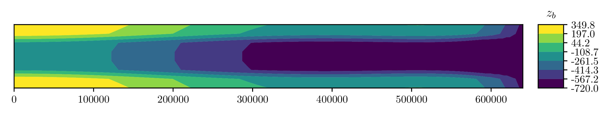
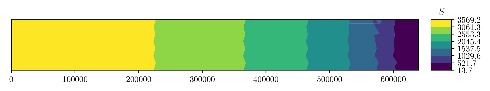
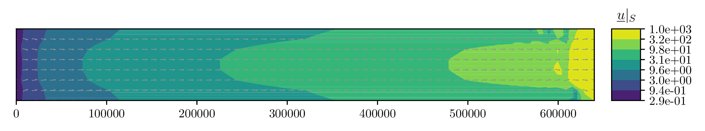
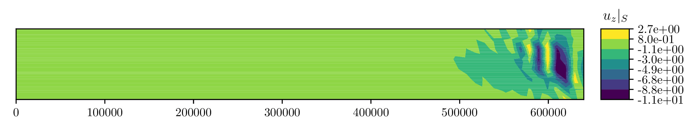

MISMIP+
===========

This page describes another example that does not require any external data; the "`3rd Marine Ice Sheet Model Intercomparison Project <http://www.climate-cryosphere.org/activities/targeted/153-misomip/1412-mismip-plus>`_".

Set up the model
----------------

First, import all the packages we will need::

  import issm  as im
  import numpy as np

Next, create some variables to use later on which set the physics and output directories to save too::

  # directories for saving data :
  mdl_odr  = 'HO' #'FS'                # [H]igher [O]rder momentum
  lat_slip = True                      # let the velocity slip on the edges
  name     = 'lateral_slip'            # the name of the simulation
  
  if mdl_odr == 'HO': mdl_pfx = 'BP'
  else:               mdl_pfx = mdl_odr
  out_dir = './results/' + mdl_pfx + '/'              # directory for data
  
  # create the output directory if it does not exist :
  import os
  d       = os.path.dirname(out_dir)
  if not os.path.exists(d):
    os.makedirs(d)

Next, create an empty :class:`~issm.model.model` instance and name the simulation::

  md = im.model()
  md.miscellaneous.name = name

The input variables are provided by [asay-davis_2016]_::

  Lx     =  640000.0    # [m] domain length (along ice flow)
  Ly     =  80000.0     # [m] domain width (across ice flow)
  dx     =  10000.0     # [m] element diameter 
  nx     =  int(Lx/dx)  # [--] number of x-coordinate divisions
  ny     =  int(Ly/dx)  # [--] number of y-coordinate divisions
  B0     = -150.0       # [m] bedrock topography at x = 0
  B2     = -728.8       # [m] second bedrock topography coefficient
  B4     =  343.91      # [m] third bedrock topography coefficient
  B6     = -50.57       # [m] second bedrock topography coefficient
  xbar   =  300000.0    # [m] characteristic along-flow length scale of bedrock
  fc     =  4000.0      # [m] characteristic width of channel walls
  dc     =  500.0       # [m] depth of the trough compared to its walls
  wc     =  24000.0     # [m] half width of the trough
  zd     = -720.0       # [m] maximum depth of the bedrock topography
  thklim =  10.0        # [m] thickness limit
  rhow   =  1028.0      # [kg m^-3] density of seawater
  rhoi   =  918.0       # [kg m^-3] density of glacier ice
  g      =  9.81        # [m s^2] gravitational acceleration
  spy    =  31556926.0  # [s a^-1] seconds per year
  Hini   =  100.0       # [m] initial ice thickness
  Tm     =  273.15      # [K] melting temperature of ice
  n      =  3.0         # [--] Glen's exponent
  A      =  2e-17       # [Pa^{-n} s^{-1}] flow 
  beta   =  1e4         # [Pa m^{-1/n} a^{-1/n}] friction coefficient
  p      =  3.0         # [--] Paterson friction exponent one
  q      =  0.0         # [--] Paterson friction exponent two
  adot   =  0.3         # [m a^{-a}] surface-mass balance
  tf     =  20000.0     # [a] final time
  dt     =  1           # [a] time step
  dt_sav =  10.0        # [a] time interval to save data
  cfl    =  0.5         # [--] CFL coefficient
  num_p  =  2           # [--] number of processor cores to use
  
Next, we make a simple two-dimensional box mesh with ``nx`` cells in the :math:`x` direction and ``ny`` cells in the :math:`y` directions over a width of ``Lx`` and height ``Ly`` using :class:`~issm.squaremesh.squaremesh`::

  md     = im.squaremesh(md, Lx, Ly, nx=nx, ny=ny)

Let the entire domain be defined over grounded ice with :class:`~issm.setmask.setmask`::

  md     = im.setmask(md, 'all', '')

It will be helpful for the rest of the script to set up the element-wise multiplicative identities now::

  # rank-zero tensor vertex ones vector :
  v_ones = np.ones(md.mesh.numberofvertices)
  
  # rank-zero tensor element ones vector :
  e_ones = np.ones(md.mesh.numberofelements)
  
  # rank-two tensor ones vector :
  A_ones = np.ones((md.mesh.numberofvertices, 6))
  
  # rank-one tensor ones vector :
  b_ones = np.ones((md.mesh.numberofvertices, 3))

The MISMIP+ geometry are specified by [gudmundsson_2012]_ and defined by Equations (1)--(4) of [asay-davis_2016]_::

  # the ice thickness is initialized as constant :
  H      = Hini * v_ones
  
  # eq'n (3)
  xt     = md.mesh.x / xbar
  
  # eq'n (2) :
  Bx     = B0 + B2*xt**2 + B4*xt**4 + B6*xt**6
  
  # eq'n (4) :
  By     = + dc / (1 + np.exp(-2*(md.mesh.y - Ly/2 - wc) / fc)) \
           + dc / (1 + np.exp( 2*(md.mesh.y - Ly/2 + wc) / fc))
  
  # lower topography (eq'n 1) :
  zb = np.maximum(Bx + By, zd*v_ones)

The bottom of the ice sheet is calculated by adjusting the upper-surface height :math:`S` to the height it would be if it were floating::
 
  # upper surface which does not take into account flotation :
  S  = zb + H
  
  # grounded ice level-set flotation :
  ls = H + rhow / rhoi * zb
  
  # get indicies of grounded (gnd) and floating (flt) ice :
  gnd = ls >  0
  flt = ls <= 0
  
  # correct upper surface to be in equilibrium with the flotation height :
  S[flt] = H[flt] * (1 - rhoi / rhow)

then the lower surface is adjusted to remain at the desired thickness::
  
  # lower surface :
  B = S - H;

Finally, the ice sheet mask is given by simply converting the boolean NumPy array ``gnd`` to an array of integers required by ``issm``::

  # ice is grounded where mask == 1 :
  mask = gnd.astype('int')

We will need to define the rheological parameter :math:`B`::

  Bf  =  (A / spy)**(-1/n)

The material parameters may be changed to match those of the ISMIP HOM experiment by changing either the :class:`~issm.model.model`'s :class:`~issm.constants.constants` or material properties :class:`~issm.matice.matice`::

  md.materials.rho_ice         = rhoi
  md.materials.rho_water       = rhow
  md.constants.g               = g
  md.constants.yts             = spy

The geometry and ice masks are initialized from the above arrays as follows::

  md.geometry.surface          = S
  md.geometry.base             = B
  md.geometry.thickness        = H
  md.geometry.bed              = zb
  md.mask.groundedice_levelset = mask              # ice is grounded where == 1
  md.mask.ice_levelset         = -1 * v_ones       # ice is present when negative
  
Basal-sliding friction is initialized using the :class:`~issm.friction.friction` coefficient::
  
  md.friction.p                =  p * e_ones
  md.friction.q                =  q * e_ones
  md.friction.coefficient      = beta * v_ones

The rheology parameters are also set within the material properties :class:`~issm.matice.matice`::
  
  md.materials.rheology_B      = Bf * v_ones
  md.materials.rheology_n      =  n * e_ones
  md.materials.rheology_law    = "None"

The :class:`~issm.basalforcings.basalforcings` are initialized with no basal meting to begin::
 
  md.basalforcings.geothermalflux           = 0.0 * v_ones
  md.basalforcings.groundedice_melting_rate = 0.0 * v_ones
  md.basalforcings.floatingice_melting_rate = 0.0 * v_ones

Next, configure the model for "marine-ice-sheet" boundary conditions via :class:`~issm.SetMarineIceSheetBC.SetMarineIceSheetBC`::
  
  # Set the default boundary conditions for an ice-sheet :
  md = im.SetMarineIceSheetBC(md, './exp/mismip_front.exp')

The ice front must be specified, and is saved as the file ``./exp/mismip_front.exp`` given by::

  ## Name:icefront
  ## Icon:0
  # Points Count  Value
  5 1.
  # X pos Y pos
  639999 -1
  640001 -1
  640001 80001
  639999 80001
  639999 -1

Note this is just a rectangle surrounding each face of the Eastern-most edge.

In order to apply lateral slip along the North, South, and West boundaries, we have to manually deterimine the nodal indicies of the :math:`x`-component of velocity ``spcvx``, :math:`y`-component of velocity ``spcvy``, and :math:`z`-component of velocity ``spcvz`` within the :class:`~issm.stressbalance.stressbalance` class and set them to ``np.nan``::
 
  # apply lateral slip on north, south, and west boundaries :
  if lat_slip:  slip = np.nan
  else:         slip = 0.0
  
  # inflow boundary condition :
  pos_w  = np.where(md.mesh.x < 0.1)[0]
  md.stressbalance.spcvx[pos_w] = 0.0
  md.stressbalance.spcvy[pos_w] = slip
  md.stressbalance.spcvz[pos_w] = slip
  
  # north wall :
  pos_n  = np.where(md.mesh.y > np.max(md.mesh.y) - 0.1)[0]
  md.stressbalance.spcvx[pos_n] = slip 
  md.stressbalance.spcvy[pos_n] = 0.0
  md.stressbalance.spcvz[pos_n] = slip
  
  # south wall :
  pos_s  = np.where(md.mesh.y < 0.1)[0]
  md.stressbalance.spcvx[pos_s] = slip
  md.stressbalance.spcvy[pos_s] = 0.0
  md.stressbalance.spcvz[pos_s] = slip
  
  # go back and ensure that the west corners have zero x-component velocity :
  md.stressbalance.spcvx[pos_w] = 0.0

Note above that if ``lat_slip`` had been specified as ``False`` at the beginning of our script, no-slip boundary conditions would have been applied.
The upper-surface mass balance :math:`\mathring{S}` is initialized::
  
  md.smb.mass_balance          = adot * v_ones

Grounding-line migration is a complicated subject, and the folks at JPL/UCI have developed several different numerical schemes you may choose to use, here I chose ``SubelementMigration`` by setting the ``migration`` parameter within the :class:`~issm.model.model`'s  :class:`~issm.groundingline.groundingline` class::
  
  #md.groundingline.migration              = 'SoftMigration'
  md.groundingline.migration              = 'SubelementMigration'
  #md.groundingline.migration              = 'SubelementMigration2'
  #md.groundingline.migration              = 'AggressiveMigration'
  #md.groundingline.migration              = 'None'

The free-surface parameters are set within the :class:`~issm.model.model`'s :class:`~issm.masstransport.masstransport` class::

  md.masstransport.hydrostatic_adjustment = 'Incremental'
  md.masstransport.spcthickness           = np.nan * v_ones
  md.masstransport.stabilization          = 1

Here, we set no constraint on the thickness by setting the ``spcthickness`` parameter to ``np.nan`` and use streamline-upwind/Petrov-Galerkin stabilization by setting ``stabilization = 1``.
The numerical solver will complain if the unknowns are not initialized to something::
 
  md.initialization.vx          = 0.0 * v_ones
  md.initialization.vy          = 0.0 * v_ones
  md.initialization.vz          = 0.0 * v_ones
  md.initialization.vel         = 0.0 * v_ones
  md.initialization.pressure    = rhoi * g * H
  md.initialization.temperature = Tm * v_ones

The :class:`~issm.transient.transient` solver parameters are set as follows::

  md.transient.isstressbalance      = 1
  md.transient.isgroundingline      = 1
  md.transient.ismasstransport      = 1
  md.transient.issmb                = 1
  md.transient.isthermal            = 0
  md.timestepping.time_adapt        = 0   # not adaptive time stepping
  md.timestepping.cfl_coefficient   = cfl # used if adaptive time stepping
  md.timestepping.time_step         = dt
  md.timestepping.final_time        = tf
  md.settings.output_frequency      = int(dt_sav/dt)
  
  md.transient.requested_outputs    = ['default',
                                       'GroundedArea',
                                       'FloatingArea',
                                       'IceVolume',
                                       'IceVolumeAboveFloatation']

Now we will convert the two-dimensional mesh into three dimensions by extruding the mesh vertically 5 cells in the :math:`z` direction with :func:`~issm.model.model.extrude`::
 
  # now, extrude and set the basal boundary conditions :
  md.extrude(6, 1.0)

and set the appropriate "flow equation" with :class:`~issm.setflowequation.setflowequation`::
  
  # specifiy the flow equation and FE basis :
  md = im.setflowequation(md, mdl_odr, 'all')
  md.flowequation.fe_HO = 'P1'

It will be necessary later to recall the initial model for plotting, so we save the model just prior to solving the transient using :func:`~issm.savevars.savevars`::

  # save the state of the model :
  im.savevars(out_dir + 'mismip_init.md', 'md', md)
  

Solve the momentum balance
--------------------------

Now, set up the computing environment variables using the :class:`~issm.generic.generic` class, enable verbose solver output with :class:`~issm.verbose.verbose`, and finally solve the system with the :class:`~issm.solve.solve` class with ``num_p`` CPU processes::
  
  md.cluster = im.generic('name', im.gethostname(), 'np', num_p)
  md.verbose = im.verbose('solution', True, 'control', True, 'convergence', True)
  md         = im.solve(md, 'Transient')
  
  # save the state of the model :
  im.savevars(out_dir + name + '.md', 'md', md)
  
  var_dict  = {'md.results.TransientSolution' : md.results.TransientSolution}
  im.savevars(out_dir + name + '.shelve', var_dict)

Note that currently, :func:`~issm.savevars.savevars` will work for small problems, but fails without error for large amounts of data.

Plot the results
----------------

You can utilize the plotting capabilities of the `fenics_viz <https://github.com/pf4d/fenics_viz>`_ package to plot the solution as follows.

First, we import the packages we need::

  from fenics_viz import print_text, plot_variable
  import issm         as im
  import numpy        as np

Next, we set the input directory to ``out_dir`` set in the previous script, as well as the time-step :math:`\Delta t` between output results we set earlier named ``dt_sav``::

  # directories for saving data :
  mdl_odr = 'HO'
  name    = 'lateral_slip'
  dt      = 10
  
  if mdl_odr == 'HO': mdl_pfx = 'BP'
  else:               mdl_pfx = mdl_odr
  out_dir = './results/' + mdl_pfx + '/'

We will output the images in a uniquie directory here::

  plt_dir = './images/' + mdl_pfx + '/' + name + '/'

Next, we load the model using :class:`~issm.loadmodel.loadmodel`::

  md = im.loadmodel(out_dir + name + '.md')
  
Record the total number of solutions saved, here the output was set the solution script to every 10 years within the :class:`~issm.transient.transient` instantiation's :class:`~issm.results.results` class object::

  n      = len(md.results.TransientSolution)
  
Next, we have to get the upper and lower surface vertex indicies so that we can extract the solution values a the lower surface :math:`z=B` and upper surface :math:`z=S`, respectively::

  vbed   = md.mesh.vertexonbase
  vsrf   = md.mesh.vertexonsurface
  
The vertex coordinates ``coords`` and cell connectivity indices ``cells`` are saved in two dimensions within the :class:`~issm.model.model`'s ``mesh`` data::

  coords = (md.mesh.x2d, md.mesh.y2d)
  cells  = md.mesh.elements2d - 1

Now, the `fenics_viz <https://github.com/pf4d/fenics_viz>`_ package's ``plot_variable`` function will take a number of parameters we can set here::
  
  # set the mesh plot parameters :  
  tp_kwargs     = {'linestyle'        : '-',
                   'lw'               : 0.5,
                   'color'            : 'k',
                   'alpha'            : 0.5}
  
  # set the vector plot parameters :
  quiver_kwargs = {'pivot'            : 'middle',
                   'color'            : '0.5',
                   'scale'            : 100,
                   'alpha'            : 1.0,
                   'width'            : 0.001,
                   'headwidth'        : 3.0, 
                   'headlength'       : 3.0, 
                   'headaxislength'   : 3.0}
  
  # the plot parameters will mostly stay the same for each plot :
  plot_kwargs = {'direc'              : plt_dir, 
                 'coords'             : coords,
                 'cells'              : cells,
                 'figsize'            : (8, 1.5),
                 'cmap'               : 'viridis',
                 'scale'              : 'lin',
                 'numLvls'            : 8,
                 'levels'             : None,
                 'levels_2'           : None,
                 'umin'               : None,
                 'umax'               : None,
                 'plot_tp'            : False,
                 'tp_kwargs'          : tp_kwargs,
                 'show'               : False,
                 'hide_x_tick_labels' : False,
                 'hide_y_tick_labels' : True,
                 'xlabel'             : '',
                 'ylabel'             : '',
                 'equal_axes'         : True,
                 'hide_axis'          : False,
                 'colorbar_loc'       : 'right',
                 'contour_type'       : 'filled',
                 'extend'             : 'neither',
                 'ext'                : '.pdf',
                 'normalize_vec'      : True,
                 'plot_quiver'        : True,
                 'quiver_kwargs'      : quiver_kwargs,
                 'res'                : 150,
                 'cb'                 : True,
                 'cb_format'          : '%.1f'}

First, we plot the bedrock topography, which is invariant with time:: 

  # the bed topography :
  plot_kwargs['title'] = r'$z_b$'
  plot_kwargs['u']     = md.geometry.bed[vbed].flatten()
  plot_kwargs['name']  = 'z_b'
  plot_variable(**plot_kwargs)

Next, we loop through and plot the solutions every :math:`\Delta t *10 = 100` years::

  for i in range(0,n,10):
  
    # get this solution :
    soln_i = md.results.TransientSolution[i]
  
    # the `plot_variable` function requires the output data be row vectors :
    S       = soln_i.Surface[vbed].flatten()
    B       = soln_i.Base[vbed].flatten()
    H       = soln_i.Thickness[vbed].flatten()
    p       = soln_i.Pressure[vbed].flatten()
    u_x_s   = soln_i.Vx[vsrf].flatten()
    u_y_s   = soln_i.Vy[vsrf].flatten()
    u_z_s   = soln_i.Vz[vsrf].flatten()
    u_x_b   = soln_i.Vx[vbed].flatten()
    u_y_b   = soln_i.Vy[vbed].flatten()
    u_z_b   = soln_i.Vz[vbed].flatten()
    ls      = soln_i.MaskGroundediceLevelset[vbed].flatten()
  
    # form the velocity vectors :
    u_s    = np.array([u_x_s, u_y_s], u_z_s])
    u_b    = np.array([u_x_b, u_y_b], u_z_b])
  
    # calculate the grounded/floating mask :
    mask   = (ls > 0).astype('int')
  
    # the simulation time :
    time = i*dt
  
    # plot the upper-surface height :
    plot_kwargs['title']       = r'$S$'
    plot_kwargs['u']           = S
    plot_kwargs['name']        = 'S_%i' % time
    plot_kwargs['scale']       = 'lin'
    plot_kwargs['cmap']        = 'viridis'
    plot_kwargs['cb_format']   = '%.1f'
    plot_kwargs['plot_tp']     = False
    plot_variable(**plot_kwargs)
  
    # plot the lower-surface height :
    plot_kwargs['title']       = r'$B$'
    plot_kwargs['u']           = B
    plot_kwargs['name']        = 'B_%i' % time
    plot_kwargs['scale']       = 'lin'
    plot_kwargs['cmap']        = 'viridis'
    plot_kwargs['cb_format']   = '%.1f'
    plot_kwargs['plot_tp']     = False
    plot_variable(**plot_kwargs)
  
    # plot the ice thickness :
    plot_kwargs['title']       = r'$H$'
    plot_kwargs['u']           = H
    plot_kwargs['name']        = 'H_%i' % time
    plot_kwargs['scale']       = 'lin'
    plot_kwargs['cmap']        = 'viridis'
    plot_kwargs['cb_format']   = '%.1f'
    plot_kwargs['plot_tp']     = False
    plot_variable(**plot_kwargs)
  
    # plot the vertical component of the upper-surface velocity :
    plot_kwargs['title']       = r'$u_z |_S$'
    plot_kwargs['u']           = u_z_s
    plot_kwargs['name']        = 'u_z_s_%i' % time
    plot_kwargs['scale']       = 'lin'
    plot_kwargs['cmap']        = 'viridis'
    plot_kwargs['cb_format']   = '%.1e'
    plot_kwargs['plot_tp']     = False
    plot_variable(**plot_kwargs)
  
    # plot the vertical component of the lower-surface velocity :
    plot_kwargs['title']       = r'$u_z |_B$'
    plot_kwargs['u']           = u_z_b
    plot_kwargs['name']        = 'u_z_b_%i' % time
    plot_kwargs['scale']       = 'lin'
    plot_kwargs['cmap']        = 'viridis'
    plot_kwargs['cb_format']   = '%.1e'
    plot_kwargs['plot_tp']     = False
    plot_variable(**plot_kwargs)
  
    # plot the upper-surface velocity :
    plot_kwargs['title']       = r'$\underline{u} |_S$'
    plot_kwargs['u']           = u_s
    plot_kwargs['name']        = 'U_s_%i' % time
    plot_kwargs['scale']       = 'log'
    plot_kwargs['cmap']        = 'viridis'
    plot_kwargs['cb_format']   = '%.1e'
    plot_kwargs['plot_tp']     = False
    plot_variable(**plot_kwargs)
  
    # plot the lower-surface velocity :
    plot_kwargs['title']       = r'$\underline{u} |_B$'
    plot_kwargs['u']           = u_b
    plot_kwargs['name']        = 'U_b_%i' % time
    plot_kwargs['scale']       = 'log'
    plot_kwargs['cmap']        = 'viridis'
    plot_kwargs['cb_format']   = '%.1e'
    plot_kwargs['plot_tp']     = False
    plot_variable(**plot_kwargs)
  
    # plot the floating-ice mask :
    plot_kwargs['title']       = r'mask'
    plot_kwargs['u']           = mask
    plot_kwargs['name']        = 'mask_%i' % time
    plot_kwargs['scale']       = 'bool'
    plot_kwargs['cmap']        = 'gist_yarg'
    plot_kwargs['cb_format']   = '%g'
    plot_kwargs['plot_tp']     = True
    plot_variable(**plot_kwargs)

This will produce a plot of final state of the model after :math:`t = 20000` years like so:

.. image:: images/B_20000.jpg
.. image:: images/H_20000.jpg
.. image:: images/U_b_20000.jpg

.. image:: images/u_z_b_20000.jpg
.. image:: images/mask_20000.jpg

Note that the velocity vectors have been normalized using the keyword argument (kwarg) ``normalize_vec = True`` of the dictionary ``plot_kwargs``.

References:
------------

.. [asay-davis_2016] https://www.geosci-model-dev.net/9/2471/2016/
.. [gudmundsson_2012] https://www.the-cryosphere.net/6/1497/2012/
